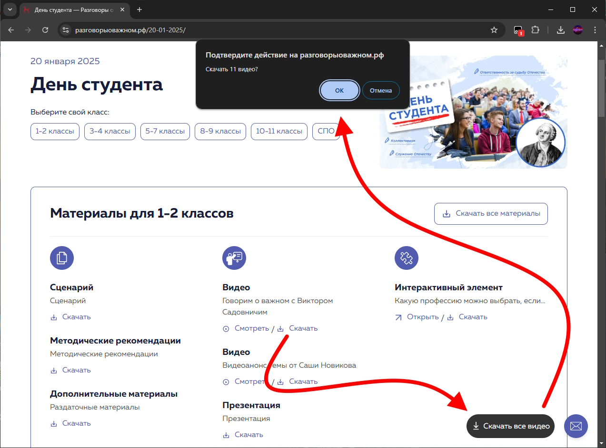

## Разговоры о важном | Скачать все видео
Скрипт для расширения браузера Tampermonkey. Добавляет на сайт "Разговоры о важном" (https://razgovor.edsoo.ru/) панель с кнопками для скачивания видео из выбранного топика (тема дня).

## Описание:

На панели распологаются 2 кнопки:
- **Скачать напрямую с сайта** \
Скрипт открывает все ссылки с видео по всем блокам материалов (от 1 до 11 классов и СПО), создаёт blob-объекты для отслеживания уже скачанных видео, генерирует ссылку для скачивания, скачивает видео и закрывает вкладку.
- **Скачать с Яндекс.Диска** (альтернативный способ) \
Скрипт открывает несколько вкладок с Яндекс.Диском по всем блокам материалов (от 1 до 11 классов и СПО), находит элемент с названием "3 видео", кликает по нему, скачивает архив и закрывает вкладку.

**Важно:** После нажатия кнопок, пожалуйста, **не закрывайте вкладки вручную**. Дождитесь завершения работы скрипта, он закроет их автоматически.

## Установка
1. Установите расширение [Tampermonkey](https://www.tampermonkey.net/) на свой браузера
2. Нажмите по ссылке для установки скрипта: [Установить скрипт](https://github.com/xnngee/important-talks-video-downloader/raw/refs/heads/main/important-talks-video-downloader.user.js)

### Дополнительная информация:

- Скрипт работает только на страницах топиков сайта "Разговоры о важном" (https://razgovor.edsoo.ru/topic/*/) и на страницах Яндекс.Диска (https://disk.yandex.ru/d/*/), открытых скриптом.
- При скачивании с Яндекс.Диска реализовано два способа: автоматический и ручной (вверху будет ссылка на скачивание архива с видео. Этот способ существует на случай, если автоматический не сработает).