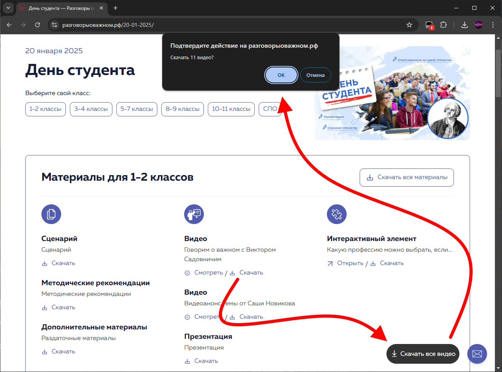

## Tampermonkey Userscript Разговоры о важном -- Скачать все видео
Скрипт для расширения браузера Tampermonkey. Добавляет на сайт "Разговоры о важном" (https://разговорыоважном.рф/) кнопку для скачивания видео из выбранного топика (темы дня).

## Описание:
На странице внизу справа появится кнопка **Скачать все видео** \
После ее нажатия, скрипт попросит вас подтвердить скачивание через alert окно браузера. Если вы подтвердите скачивание, скрипт найдёт все элементы с классом `material-item`, расположенные в секции `.materials-section .materials-content .materials-column:nth-child(2)`, и проверит наличие в них тэга <strong>Видео</strong>. Если такой элемент будет найден, скрипт соберёт все уникальные ссылки с атрибутом `download` из `material-item` и начнёт скачивать видео из всех секций.

## Установка
1. Установите расширение [Tampermonkey](https://www.tampermonkey.net/) на свой браузера
2. Нажмите по ссылке для установки скрипта: [Установить скрипт](https://github.com/xnngee/important-talks-video-downloader/raw/refs/heads/main/important-talks-video-downloader.user.js)
