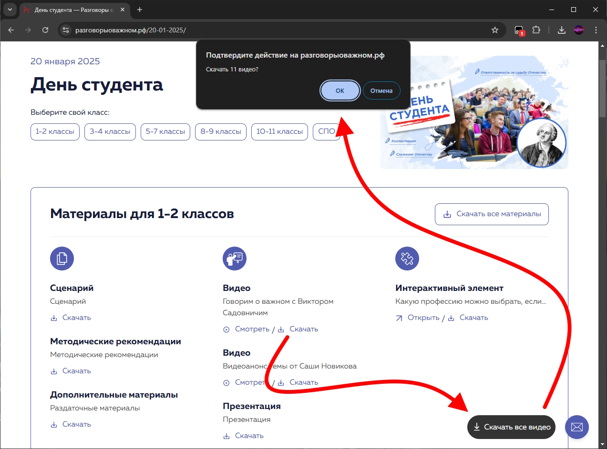

## Tampermonkey Userscript Разговоры о важном -- Скачать все видео
Скрипт для расширения браузера Tampermonkey. Добавляет на сайт "Разговоры о важном" (https://разговорыоважном.рф/) кнопку для скачивания видео из выбранного топика (темы дня).

## Описание
Скрипт обновлён под новую вёрстку сайта. На странице внизу справа появится кнопка **Скачать все видео**.

Перед нажатием кнопки нужно открыть страницу дня с якорем выбранного класса или СПО, например:

- `https://xn--80aafadvc9bifbaeqg0p.xn--p1ai/21-09-2026/#klass_spo2-4`
- `https://xn--80aafadvc9bifbaeqg0p.xn--p1ai/21-09-2026/#klass_6-7`

Скрипт берёт только секцию `section.materials-section`, указанную в якоре `#klass_*`. Если якорь не выбран, скачивание не запускается.

После нажатия кнопки скрипт:
1. Найдёт в выбранной секции элементы `material-item` с тегом `<strong>`, содержащим `Видео`.
2. Соберёт уникальные ссылки с атрибутом `download` только на видеофайлы `.mp4`, `.webm`, `.mov` или `.m4v`.
3. Исключит не являющиеся видео ссылки, например заглушку `/img/v2/404.jpg` для ещё не загруженного ролика с сурдопереводом.
4. Подсветит найденные ссылки на странице (зелёным — уникальные, красным — дубликаты).
5. Добавит к ссылкам текстовую метку с именем файла.
6. Попросит подтвердить скачивание через окно `confirm` с указанием количества видео.

## Установка
1. Установите расширение [Tampermonkey](https://www.tampermonkey.net/) в браузере
2. Нажмите по ссылке для установки скрипта: [Установить скрипт](https://github.com/xnngee/important-talks-video-downloader/raw/refs/heads/main/important-talks-video-downloader.user.js)
